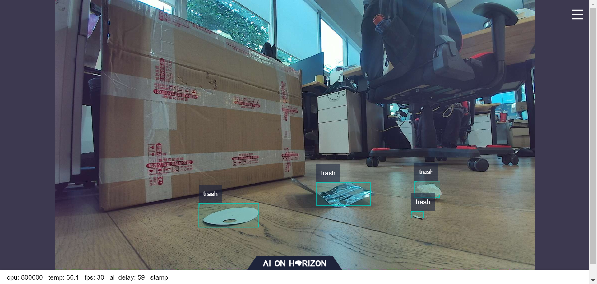
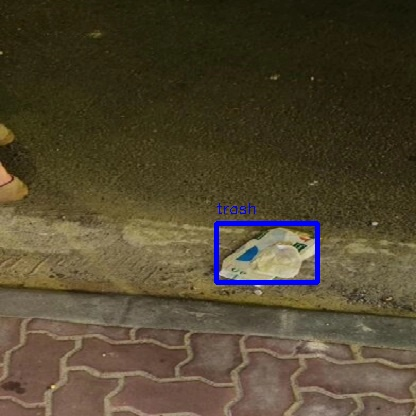

# 功能介绍

mono2d_trash_detection package 是基于 hobot_dnn package 开发的2D垃圾目标检测算法示例，在地平线的旭日X3派上利用BPU进行模型推理，从而得到AI推理结果。与其他示例不同，本示例展示了如何利用现有的 hobot_dnn_example package，通过配置文件更替适配垃圾检测模型，达到快速部署的目的。基于此类部署方法，用户可以将更多精力投入在算法模型能力的迭代，利用现有 package 减少部署工作量。本package支持直接订阅sensors/msg/Image类型的话题，并且支持读取本地图片的形式进行推理，将AI信息通过话题发布的同时会将结果在Web页面渲染可视化，本地图片回灌时将渲染图片保存在当前目录。

算法支持的目标检测类别如下：

```
1. 垃圾
```

每个类别包含长、宽、类别等信息。package对外发布包含语义分割和目标检测信息的AI Msg，用户可以订阅发布的AI Msg用于应用开发。
完整的AI Msg描述如下所示：

````

# 检测消息
Roi[] rois
数据结构：
std::string type
int rect.x_offset
int rect.y_offset
int rect.width
int rect.height

# 检测类型名称，如：垃圾
# trash

````

# 编译

## 开发环境

- 编程语言: C/C++
- 开发平台: X3/X86
- 系统版本：Ubuntu 20.04
- 编译工具链:Linux GCC 9.3.0/Linaro GCC 9.3.0

## 编译

 支持在X3 Ubuntu系统上编译和在PC上使用docker交叉编译两种方式。

### Ubuntu板端编译X3

1. 编译环境确认 
   - 板端已安装X3 Ubuntu系统。
   - 当前编译终端已设置TogetherROS环境变量：`source PATH/setup.bash`。其中PATH为TogetherROS的安装路径。
   - 已安装ROS2编译工具colcon，安装命令：`pip install -U colcon-common-extensions`
2. 编译

 编译命令：`colcon build --packages-select mono2d_trash_detection`

### Docker交叉编译X3

1. 编译环境确认

   - 在docker中编译，并且docker中已经安装好TogetherROS。docker安装、交叉编译说明、TogetherROS编译和部署说明详见机器人开发平台robot_dev_config repo中的README.md。

2. 编译

   - 编译命令：

   ```
   export TARGET_ARCH=aarch64
   export TARGET_TRIPLE=aarch64-linux-gnu
   export CROSS_COMPILE=/usr/bin/$TARGET_TRIPLE-

   colcon build --packages-select mono2d_trash_detection \
      --merge-install \
      --cmake-force-configure \
      --cmake-args \
      --no-warn-unused-cli \
      -DCMAKE_TOOLCHAIN_FILE=`pwd`/robot_dev_config/aarch64_toolchainfile.cmake
   ```

### X86 Ubuntu系统上编译X86版本

1. 编译环境确认

   - x86 ubuntu版本: ubuntu20.04

2. 编译

   - 编译命令：

   ```
   colcon build --packages-select mono2d_trash_detection  \
      --merge-install \
      --cmake-args \
      -DTHIRD_PARTY=`pwd`/../sysroot_docker \
   ```

## 注意事项

# 使用介绍

## 依赖

- mipi_cam package: 发布图片msg
- hobot_codec package: jpeg图片编码&发布
- hobot_usb_cam package: 发布usb图片msg
- nv12_codec_node package: nv12图片解码&发布
- dnn_node_example package: 算法pkg发布检测ai感知msg
- websocket package: 渲染图片和ai感知msg

## 参数

| 参数名             | 解释                                  | 是否必须             | 默认值              | 备注                                                                    |
| ------------------ | ------------------------------------- | -------------------- | ------------------- | ----------------------------------------------------------------------- |
| feed_type          | 图片来源，0：本地；1：订阅            | 否                   | 0                   |                                                                         |
| image              | 本地图片地址                          | 否                   | config/test.jpg     |                                                                         |
| image_type         | 图片格式，0：bgr，1：nv12             | 否                   | 0                   |                                                                         |
| image_width        | 本地回灌nv12格式图片的宽度            | nv12格式图片必须设置 | 0                   |                                                                         |
| image_height       | 本地回灌nv12格式图片的高度            | nv12格式图片必须设置 | 0                   |                                                                         |
| is_shared_mem_sub  | 使用shared mem通信方式订阅图片        | 否                   | 0                   |                                                                         |
| config_file        | 配置文件路径                          | 否                   | ""                  | 更改配置文件配置不同模型调用不同后处理算法,默认启用fasterrcnn模型后处理 |
| dump_render_img    | 是否进行渲染，0：否；1：是            | 否                   | 0                   |                                                                         |
| msg_pub_topic_name | 发布智能结果的topicname,用于web端展示 | 否                   | hobot_dnn_detection |          

## 配置文件

- config_file配置文件格式为json格式，本示例ppyoloworkconfig.json，具体配置如下：
  {
    "model_file"：模型文件的路径
    "model_name"：模型名称
    "dnn_Parser"：设置选择内置的后处理算法，示例采用的解析方法同yolov3，采用"yolov3"
    "model_output_count"：模型输出branch个数
	"class_num": 检测类别数
	"cls_names_list": 检测类别具体标签
	"strides": 每个输出branch步长
	"anchors_table": 预设anchors比例
	"score_threshold": 置信度阈值
	"nms_threshold": NMS后处理IOU阈值
	"nms_top_k": NMS后处理选取的框个数
  }

说明：实际每个预设anchors大小为 anchors_table x strides

## 运行

编译成功后，将生成的install路径拷贝到地平线旭日X3开发板上（如果是在X3上编译，忽略拷贝步骤），并执行如下命令运行：

### **X3 Ubuntu**

```
export COLCON_CURRENT_PREFIX=./install
source ./install/setup.bash
# config中为示例使用的模型，根据实际安装路径进行拷贝
# 如果是板端编译（无--merge-install编译选项），拷贝命令为cp -r install/PKG_NAME/lib/PKG_NAME/config/ .，其中PKG_NAME为具体的package名。
cp -r install/lib/mono2d_trash_detection/config/ .

# 启动dnn_node_example node
ros2 run dnn_node_example example --ros-args -p feed_type:=0 -p image:=config/trashDet0028.jpg -p image_type:=0 -p dump_render_img:=1 -p config_file:=config/ppyoloworkconfig.json
```

### **X3 Ubuntu Launch启动**

```
export COLCON_CURRENT_PREFIX=./install
source ./install/setup.bash
# config中为示例使用的模型，根据实际安装路径进行拷贝
# 如果是板端编译（无--merge-install编译选项），拷贝命令为cp -r install/PKG_NAME/lib/PKG_NAME/config/ .，其中PKG_NAME为具体的package名。
cp -r install/lib/mono2d_trash_detection/config/ .

# 启动dnn_node_example package
# mipi摄像头输入检测，渲染结果在Web页面可视化
export CAM_TYPE=mipi
ros2 launch dnn_node_example hobot_dnn_node_example.launch.py config_file:=config/ppyoloworkconfig.json msg_pub_topic_name:=ai_msg_mono2d_trash_detection image_width:=1920 image_height:=1080

# 启动dnn_node_example package
# usb摄像头输入检测，渲染结果在Web页面可视化
export CAM_TYPE=usb
ros2 launch dnn_node_example hobot_dnn_node_example.launch.py config_file:=config/ppyoloworkconfig.json msg_pub_topic_name:=ai_msg_mono2d_trash_detection image_width:=1920 image_height:=1080

# 单张图片回灌，渲染结果在Web页面可视化并保存到本地
ros2 launch dnn_node_example hobot_dnn_node_example_feedback.launch.py config_file:=config/ppyoloworkconfig.json image:=config/trashDet0028.jpg
```

### **X3 Linux**
如果需要在PC端浏览器上渲染显示sensor发布的图片和对应的AI结果，确认旭日X3派已经启动用于web展示的webserver服务（设备启动后只需要启动一次服务，只有设备重启的情况下需要重新启动服务）。旭日X3派执行ps -aux命令查看是否有nginx进程，如果有表示已经启动此服务，如果无，启动服务，运行方法为：
```
cd /opt/tros/lib/websocket/webservice/
chmod +x ./sbin/nginx && ./sbin/nginx -p .
cd -
```

```
export ROS_LOG_DIR=/userdata/
export LD_LIBRARY_PATH=${LD_LIBRARY_PATH}:./install/lib/

# config中为示例使用的模型，根据实际安装路径进行拷贝
cp -r ./install/lib/mono2d_trash_detection/config/ .

# 启动图片发布pkg
./install/lib/mipi_cam/mipi_cam --ros-args -p out_format:=nv12 -p image_width:=416 -p image_height:=416 -p io_method:=shared_mem -p video_device:=GC4663 --log-level error &

# 启动JPEG图片编码&发布pkg
./install/lib/hobot_codec/hobot_codec_republish --ros-args -p channel:=1 -p in_mode:=shared_mem -p in_format:=nv12 -p out_mode:=ros -p out_format:=jpeg -p sub_topic:=/hbmem_img -p pub_topic:=/image_jpeg --ros-args --log-level error &

# 启动web展示pkg
./install/lib/websocket/websocket --ros-args -p image_topic:=/image_jpeg -p image_type:=mjpeg -p smart_topic:=/ai_msg_mono2d_trash_detection --log-level error &

# 启动dnn_node_example node
./install/lib/dnn_node_example/example  --ros-args -p feed_type:=1 -p is_shared_mem_sub:=1 -p dump_render_img:=0 -p msg_pub_topic_name:=/ai_msg_mono2d_trash_detection --log-level warn &
```

### **X86 Ubuntu**

```
export COLCON_CURRENT_PREFIX=./install
source ./install/setup.bash

# config中为示例使用的模型，根据实际安装路径进行拷贝
cp -r ./install/lib/mono2d_trash_detection/config/ .

#设置运行环境变量
export LD_LIBRARY_PATH=${LD_LIBRARY_PATH}:`pwd`/../sysroot_docker/usr/lib

# 启动dnn_node_example node
ros2 run dnn_node_example example --ros-args -p feed_type:=0 -p image:=config/trashDet0028.jpg -p image_type:=0 -p dump_render_img:=1 -p config_file:=config/ppyoloworkconfig.json

```

# 结果分析
## X3结果展示

输出log日志：
```
[example-3] [WARN] [1665644838.299475772] [example]: This is dnn node example!
[example-3] [WARN] [1665644838.439577121] [example]: Parameter:
[example-3]  feed_type(0:local, 1:sub): 1
[example-3]  image: config/test.jpg
[example-3]  image_type: 0
[example-3]  dump_render_img: 0
[example-3]  is_shared_mem_sub: 1
[example-3]  config_file: config/ppyoloworkconfig.json
[example-3]  msg_pub_topic_name_: ai_msg_mono2d_trash_detection
[example-3] [WARN] [1665644838.441379412] [example]: Parameter:
[example-3]  model_file_name: config/ppyolo_trashdet_416x416_nv12.bin
[example-3]  model_name: ppyolo_trashdet_416x416_nv12
[example-3] [WARN] [1665644838.441523485] [example]: model_file_name_: config/ppyolo_trashdet_416x416_nv12.bin, task_num: 4
[example-3] [C][34177][10-13][15:07:18:448][configuration.cpp:49][EasyDNN]EasyDNN version: 0.4.11
[example-3] [BPU_PLAT]BPU Platform Version(1.3.1)!
[example-3] [HBRT] set log level as 0. version = 3.14.5
[example-3] [DNN] Runtime version = 1.9.7_(3.14.5 HBRT)
[example-3] [WARN] [1665644838.688580704] [dnn]: Run default SetOutputParser.
[example-3] [WARN] [1665644838.688758775] [dnn]: Set output parser with default dnn node parser, you will get all output tensors and should parse output_tensors in PostProcess.
[example-3] [WARN] [1665644838.691224728] [example]: Create ai msg publisher with topic_name: ai_msg_mono2d_trash_detection
[example-3] [WARN] [1665644838.698936232] [example]: Create img hbmem_subscription with topic_name: /hbmem_img
[example-3] [WARN] [1665644839.926634917] [example]: Sub img fps: 32.45, Smart fps: 33.07, infer time ms: 36, post process time ms: 5
[example-3] [WARN] [1665644840.950361855] [example]: Sub img fps: 30.30, Smart fps: 30.21, infer time ms: 40, post process time ms: 3
[example-3] [WARN] [1665644841.971040371] [example]: Sub img fps: 30.39, Smart fps: 30.48, infer time ms: 36, post process time ms: 7
[example-3] [WARN] [1665644842.972618649] [example]: Sub img fps: 29.94, Smart fps: 29.88, infer time ms: 36, post process time ms: 3
[example-3] [WARN] [1665644843.982243911] [example]: Sub img fps: 29.62, Smart fps: 29.70, infer time ms: 36, post process time ms: 3
[example-3] [WARN] [1665644844.995728928] [example]: Sub img fps: 29.79, Smart fps: 29.73, infer time ms: 36, post process time ms: 6

```

WEB端展示效果：

<br/>

## 本地效果展示

输出log日志：
```
[example-1] [INFO] [1665646256.967568866] [dnn]: The model input 0 width is 416 and height is 416
[example-1] [WARN] [1665646256.967698807] [dnn]: Run default SetOutputParser.
[example-1] [WARN] [1665646256.967754550] [dnn]: Set output parser with default dnn node parser, you will get all output tensors and should parse output_tensors in PostProcess.
[example-1] [INFO] [1665646256.967794962] [dnn impl]: Set default output parser
[example-1] [INFO] [1665646256.967972439] [dnn]: Task init.
[example-1] [INFO] [1665646256.970036756] [dnn]: Set task_num [4]
[example-1] [INFO] [1665646256.970176988] [example]: The model input width is 416 and height is 416
[example-1] [WARN] [1665646256.970260061] [example]: Create ai msg publisher with topic_name: hobot_dnn_detection
[example-1] [INFO] [1665646256.977452592] [example]: Dnn node feed with local image: config/trashDet0028.jpg
[example-1] [INFO] [1665646257.027170005] [dnn]: task id: 3 set bpu core: 2
[example-1] [INFO] [1665646257.057492754] [example]: Output from frame_id: feedback, stamp: 0.0
[example-1] [INFO] [1665646257.063816821] [PostProcessBase]: out box size: 1
[example-1] [INFO] [1665646257.064070497] [PostProcessBase]: det rect: 216.061 223.173 317.97 282.748, det type: trash, score:0.80733
[example-1] [INFO] [1665646257.064206479] [ClassificationPostProcess]: out cls size: 0
[example-1] [INFO] [1665646257.068688365] [ImageUtils]: target size: 1
[example-1] [INFO] [1665646257.068836554] [ImageUtils]: target type: trash, rois.size: 1
[example-1] [INFO] [1665646257.068884048] [ImageUtils]: roi.type: , x_offset: 216 y_offset: 223 width: 101 height: 59
[example-1] [WARN] [1665646257.071375688] [ImageUtils]: Draw result to file: render_feedback_0_0.jpeg

```
本地渲染效果：

<br/>

## 结果说明
示例中展示了垃圾检测的实时推理效果。本地效果展示中展示了将回灌图片渲染保存在本地。

设置"dump_render_img"为1时，渲染图片实时保持在当前路径下。
