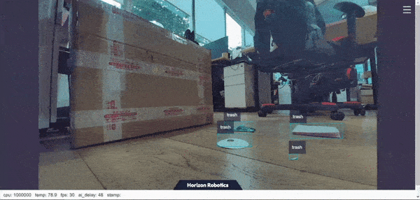

# 功能介绍

本Node是基于hobot_dnn开发的2D垃圾目标检测算法，采用[PaddlePaddle](https://github.com/PaddlePaddle/PaddleDetection.git)开源框架， 利用[PPYOLO](https://github.com/PaddlePaddle/PaddleDetection/tree/release/2.5)模型进行垃圾检测任务设计和训练。为了达到快速部署的目的，本Node支持配置文件更换垃圾检测模型，开发者可以将更多精力投入在算法模型能力的迭代，减少部署工作量，识别输出的AI信息不仅可以通过话题发布，还可以在Web页面渲染显示。


# 物料清单
| 物料选项    | 清单      |
| ------- | ------------ |
| RDK X3  | [购买链接](https://developer.horizon.ai/sunrise) |
| 摄像头 | [MIPI相机](https://github.com/HorizonRDK/hobot_mipi_cam)、[USB相机](https://github.com/HorizonRDK/hobot_usb_cam) |


# 使用方式

## MIPI相机动态识别

```bash
# 配置ROS2环境
source /opt/tros/setup.bash

# 从tros的安装路径中拷贝出运行示例需要的配置文件。
cp -r /opt/tros/lib/mono2d_trash_detection/config/ .

# 配置MIPI摄像头
export CAM_TYPE=mipi

# 启动launch文件
ros2 launch dnn_node_example dnn_node_example.launch.py dnn_example_config_file:=config/ppyoloworkconfig.json dnn_example_msg_pub_topic_name:=ai_msg_mono2d_trash_detection dnn_example_image_width:=1920 dnn_example_image_height:=1080
```


## USB相机动态识别


```bash
# 配置ROS2环境
source /opt/tros/setup.bash

# 从tros的安装路径中拷贝出运行示例需要的配置文件。
cp -r /opt/tros/lib/mono2d_trash_detection/config/ .

# 配置USB摄像头
export CAM_TYPE=usb

# 启动launch文件
ros2 launch dnn_node_example dnn_node_example.launch.py dnn_example_config_file:=config/ppyoloworkconfig.json dnn_example_msg_pub_topic_name:=ai_msg_mono2d_trash_detection dnn_example_image_width:=1920 dnn_example_image_height:=1080
```


## 可视化显示

PC打开浏览器（chrome/firefox/edge）输入[http://IP:8000](http://ip:8000/)（IP为地平线RDK IP地址），点击左上方Web端展示即可看到摄像头输出的实时画面：




# 接口说明

## 话题
| 话题名 | 消息类型          | 说明               |
| ------ | ----------------- | ------------------ |
|        | sensors/msg/Image | 订阅输入的图像话题 |
|        |                   | 发布目标识别结果   |

本Node支持的垃圾目标检测结果包含长、宽、类别等信息，对外发布包含语义分割和目标检测信息的AI Msg，用户可以订阅发布的AI Msg用于应用开发，完整的AI Msg描述如下所示：

````
# 检测消息
Roi[] rois
数据结构：
std::string type
int rect.x_offset
int rect.y_offset
int rect.width
int rect.height

# 检测类型名称，如：垃圾
# trash
````


## 参数

| 参数名             | 解释                                  | 是否必须             | 默认值              | 备注                                                                    |
| ------------------ | ------------------------------------- | -------------------- | ------------------- | ----------------------------------------------------------------------- |
| feed_type          | 图片来源，0：本地；1：订阅            | 否                   | 0                   |                                                                         |
| image              | 本地图片地址                          | 否                   | config/test.jpg     |                                                                         |
| image_type         | 图片格式，0：bgr，1：nv12             | 否                   | 0                   |                                                                         |
| image_width        | 本地回灌nv12格式图片的宽度            | nv12格式图片必须设置 | 0                   |                                                                         |
| image_height       | 本地回灌nv12格式图片的高度            | nv12格式图片必须设置 | 0                   |                                                                         |
| is_shared_mem_sub  | 使用shared mem通信方式订阅图片        | 否                   | 0                   |                                                                         |
| config_file        | 配置文件路径                          | 否                   | ""                  | 更改配置文件配置不同模型调用不同后处理算法,默认启用fasterrcnn模型后处理 |
| dump_render_img    | 是否进行渲染，0：否；1：是            | 否                   | 0                   |                                                                         |
| msg_pub_topic_name | 发布智能结果的topicname,用于web端展示 | 否                   | hobot_dnn_detection |          

## 配置文件

本Node的配置文件为ppyoloworkconfig.json，具体配置如下：

```json
  {
    "model_file"：模型文件的路径
    "dnn_Parser"：设置选择内置的后处理算法，示例采用的解析方法同yolov3，采用"yolov3"
    "model_output_count"：模型输出branch个数
	"class_num": 检测类别数
	"cls_names_list": 检测类别具体标签
	"strides": 每个输出branch步长
	"anchors_table": 预设anchors比例
	"score_threshold": 置信度阈值
	"nms_threshold": NMS后处理IOU阈值
	"nms_top_k": NMS后处理选取的框个数
  }
```

说明：实际每个预设anchors大小为 anchors_table x strides


# 参考资料

- 模型训练：[PPYOLO垃圾检测+地平线地平线RDK部署（上）](https://aistudio.baidu.com/aistudio/projectdetail/4606468?contributionType=1)
- 模型转换：[PPYOLO垃圾检测+地平线地平线RDK部署（下）](https://aistudio.baidu.com/aistudio/projectdetail/4754526?contributionType=1)
