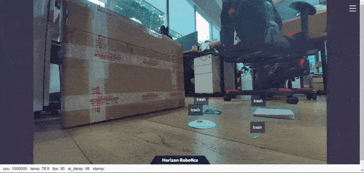

[English](./README.md) | [简体中文](./README_cn.md) | 日本語

# 機能説明

このNodeはhobot_dnnをベースに開発された2Dゴミ検出アルゴリズムで、[PaddlePaddle](https://github.com/PaddlePaddle/PaddleDetection.git)オープンソースフレームワークを採用し、[PPYOLO](https://github.com/PaddlePaddle/PaddleDetection/tree/release/2.5)モデルを利用してゴミ検出タスクの設計と訓練を行っています。迅速なデプロイを実現するため、このNodeは設定ファイルを通じてゴミ検出モデルの変更をサポートしており、開発者はアルゴリズムモデルの能力向上に集中でき、デプロイ作業量を削減できます。認識結果のAI情報はトピックで公開されるだけでなく、Webページでレンダリング表示することも可能です。


# 機材リスト
| 機材オプション    | リスト      |
| ------- | ------------ |
| RDK X3  | [購入リンク](https://developer.horizon.ai/sunrise) |
| カメラ | [MIPIカメラ](https://github.com/D-Robotics/hobot_mipi_cam)、[USBカメラ](https://github.com/D-Robotics/hobot_usb_cam) |


# 使用方法

## MIPIカメラによる動的認識

tros foxy バージョン
``` bash
# ROS2環境を設定
source /opt/tros/setup.bash

# trosのインストールパスから実行サンプルに必要な設定ファイルをコピー
cp -r /opt/tros/${TROS_DISTRO}/lib/mono2d_trash_detection/config/ .

# MIPIカメラを設定
export CAM_TYPE=mipi

# launchファイルを起動
ros2 launch dnn_node_example dnn_node_example.launch.py dnn_example_config_file:=config/ppyoloworkconfig.json dnn_example_msg_pub_topic_name:=ai_msg_mono2d_trash_detection dnn_example_image_width:=1920 dnn_example_image_height:=1080
```

tros humble バージョン
``` bash
# ROS2環境を設定
source /opt/tros/humble/setup.bash

# trosのインストールパスから実行サンプルに必要な設定ファイルをコピー
cp -r /opt/tros/${TROS_DISTRO}/lib/mono2d_trash_detection/config/ .

# MIPIカメラを設定
export CAM_TYPE=mipi

# launchファイルを起動
ros2 launch dnn_node_example dnn_node_example.launch.py dnn_example_config_file:=config/ppyoloworkconfig.json dnn_example_msg_pub_topic_name:=ai_msg_mono2d_trash_detection dnn_example_image_width:=1920 dnn_example_image_height:=1080
```

## USBカメラによる動的認識

tros foxy バージョン
``` bash
# ROS2環境を設定
source /opt/tros/setup.bash

# trosのインストールパスから実行サンプルに必要な設定ファイルをコピー
cp -r /opt/tros/${TROS_DISTRO}/lib/mono2d_trash_detection/config/ .

# USBカメラを設定
export CAM_TYPE=usb

# launchファイルを起動
ros2 launch dnn_node_example dnn_node_example.launch.py dnn_example_config_file:=config/ppyoloworkconfig.json dnn_example_msg_pub_topic_name:=ai_msg_mono2d_trash_detection dnn_example_image_width:=1920 dnn_example_image_height:=1080
```

tros humble バージョン
``` bash
# ROS2 humble環境を設定
source /opt/tros/humble/setup.bash

# trosのインストールパスから実行サンプルに必要な設定ファイルをコピー
cp -r /opt/tros/${TROS_DISTRO}/lib/mono2d_trash_detection/config/ .

# USBカメラを設定
export CAM_TYPE=usb

# launchファイルを起動
ros2 launch dnn_node_example dnn_node_example.launch.py dnn_example_config_file:=config/ppyoloworkconfig.json dnn_example_msg_pub_topic_name:=ai_msg_mono2d_trash_detection dnn_example_image_width:=1920 dnn_example_image_height:=1080
```

## 可視化表示

PCでブラウザ（chrome/firefox/edge）を開き、[http://IP:8000](http://ip:8000/)（IPはRDKのIPアドレス）を入力し、左上のWeb表示をクリックすると、カメラのリアルタイム映像が表示されます：




# インターフェース説明

## トピック
| トピック名 | メッセージ型          | 説明               |
| ------ | ----------------- | ------------------ |
|        | sensors/msg/Image | 入力画像トピックを購読 |
|        |                   | 目標認識結果を公開   |

このNodeがサポートするゴミ目標検出結果には、長さ、幅、クラスなどの情報が含まれており、セマンティックセグメンテーションと目標検出情報を含むAI Msgを外部に公開します。ユーザーは公開されたAI Msgを購読してアプリケーション開発に利用でき、完全なAI Msgの記述は以下の通りです：

```
# 検出メッセージ
Roi[] rois
データ構造：
std::string type
int rect.x_offset
int rect.y_offset
int rect.width
int rect.height

# 検出タイプ名、例：ゴミ
# trash
```


## パラメータ

| パラメータ名             | 説明                                  | 必須             | デフォルト値              | 備考                                                                    |
| ------------------ | ------------------------------------- | -------------------- | ------------------- | ----------------------------------------------------------------------- |
| feed_type          | 画像ソース、0：ローカル；1：購読            | 否                   | 0                   |                                                                         |
| image              | ローカル画像アドレス                          | 否                   | config/test.jpg     |                                                                         |
| image_type         | 画像フォーマット、0：bgr，1：nv12             | 否                   | 0                   |                                                                         |
| image_width        | ローカルnv12形式画像の幅            | nv12形式画像必須設定 | 0                   |                                                                         |
| image_height       | ローカルnv12形式画像の高さ            | nv12形式画像必須設定 | 0                   |                                                                         |
| is_shared_mem_sub  | shared mem通信方式で画像を購読        | 否                   | 0                   |                                                                         |
| config_file        | 設定ファイルパス                          | 否                   | ""                  | 設定ファイルを変更して異なるモデルと呼び出す異なる後処理アルゴリズムを設定、デフォルトでfasterrcnnモデル後処理を有効化 |
| dump_render_img    | レンダリングするかどうか、0：否；1：是            | 否                   | 0                   |                                                                         |
| msg_pub_topic_name | スマート結果を公開するtopicname、Web表示用 | 否                   | hobot_dnn_detection |          

## 設定ファイル

このNodeの設定ファイルはppyoloworkconfig.jsonで、具体的な設定は以下の通り：

``` json
  {
    "model_file"：モデルファイルのパス
    "dnn_Parser"：組み込み後処理アルゴリズムの選択を設定、サンプルで採用された解析方法はyolov3と同じ、"yolov3"を採用
    "model_output_count"：モデル出力branch数
	"class_num": 検出クラス数
	"cls_names_list": 検出クラス具体ラベル
	"strides": 各出力branchストライド
	"anchors_table": プリセットanchors比率
	"score_threshold": 信頼度閾値
	"nms_threshold": NMS後処理IOU閾値
	"nms_top_k": NMS後処理で選択されるボックス数
  }
```

説明：実際の各プリセットanchorsサイズは anchors_table x strides


# 参考資料

- モデル訓練：[PPYOLOゴミ検出+RDKデプロイ（上）](https://aistudio.baidu.com/aistudio/projectdetail/4606468?contributionType=1)
- モデル変換：[PPYOLOゴミ検出+RDKデプロイ（下）](https://aistudio.baidu.com/aistudio/projectdetail/4754526?contributionType=1)
